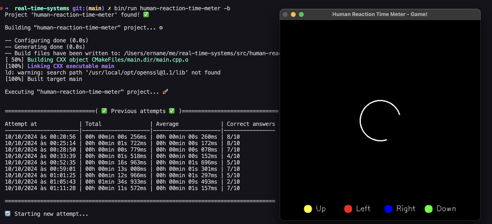

# Human Reaction Time Meter Game

This project is designed to measure and enhance your reaction time through a fun and interactive game. Players will be presented with colored circles and must quickly press the corresponding key to test their reflexes.



## Features

- Randomized colors for each round
- Spiral animation to build anticipation
- Record of past game results
- Simple and intuitive user interface

## Usage

1. Run after cloning this repository
```bash
 bin/run human-reaction-time-meter -b 
```

1. Follow the on-screen instructions to start the game.

2. Press the correct key corresponding to the color displayed in the circle to test your reaction time.

3. After completing all rounds, your results will be saved, and you can view previous attempts.

## Game Controls

- 🟡: Press `Arrow UP`
- 🔴: Press `Arrow Left`
- 🔵: Press `Arrow Right`
- 🟢: Press `Arrow Down`
- **Exit**: Press `Esc`

## Results

At the end of the game, results will be displayed, and your performance will be recorded in a file named `game_results.txt`. You can view your past attempts by running the game again.
