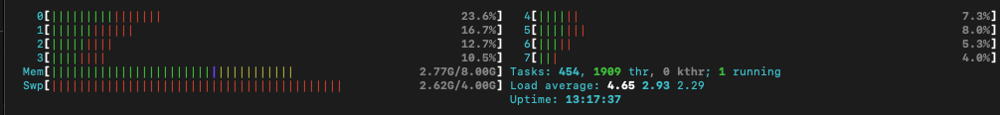

# Sleep Program ⏳

The program is an experiment designed to measure execution time in a real-time systems context. Calculates the current time in seconds since the Unix epoch (00:00:00 UTC on January 1, 1970) and measures the execution time of a sleep(4) to illustrate how this is handled.

## How To Build and Run

```bash
cd repository/path
chmod +x bin/run #if necessary
bin/run time # use -b to force build
```

Perform 8 executions on a Macbook M1 with 8 cores this is the result we have:

