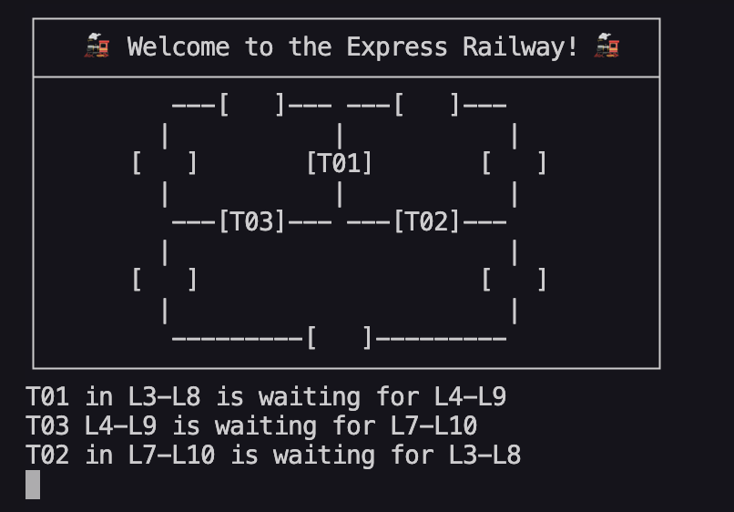

# Express Railway - Mutexes and Threads

## Execution

### Expectation


### Output

```bash
  bin/run threads/trains2 -b
```


### Possible DeadLock

Critical order, reversing these two lines causes deadlock

```diff
// src/threads/trains2/main.cpp
- 147: pthread_mutex_unlock(&mutexF2);
+ 147: pthread_mutex_lock(&mutexF3);
- 148: pthread_mutex_lock(&mutexF3);
+ 148: pthread_mutex_unlock(&mutexF2);
```

