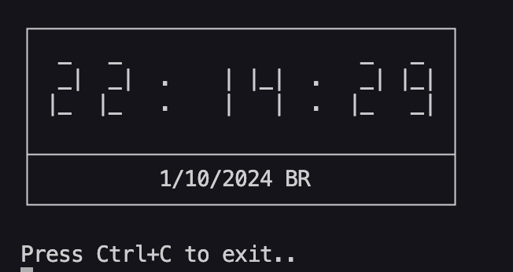

A simpler implementation:

```cpp
#include <iostream>
#include <ctime>

using namespace std;

int main() {
  struct tm *timePointer;  
  time_t currentTime;

  time(&currentTime);
  timePointer = localtime(&currentTime);

  cout << "Current timestamp: " 
       << timePointer->tm_mday << "/" 
       << timePointer->tm_mon + 1 << "/" 
       << timePointer->tm_year + 1900 << "\t" 
       << timePointer->tm_hour << ":" 
       << timePointer->tm_min << ":" 
       << timePointer->tm_sec << "\n";

  return 0;
}

```

However, the digital clock is better! ⏰✨



[Code here!](./main.cpp)